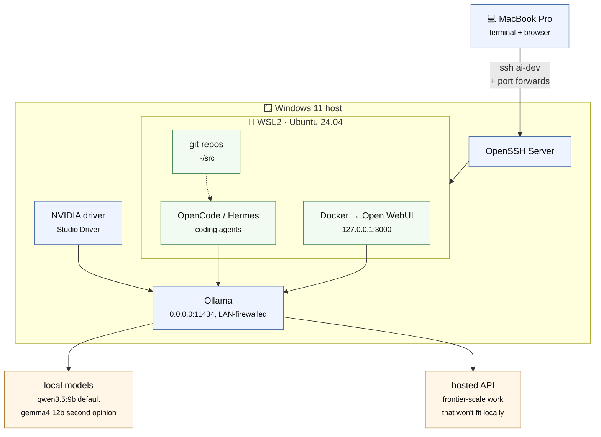
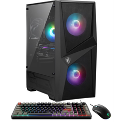

# Local AI Workstation

Turn a Windows gaming PC with an NVIDIA GPU into a local AI development server
you SSH into from a Mac (or any other machine) —
[Ollama](https://ollama.com) for running models on your own hardware,
[OpenCode](https://opencode.ai) and [Hermes](https://hermes-agent.nousresearch.com)
for coding agents, and [Open WebUI](https://openwebui.com) for a browser front end.

Built and documented on a Ryzen 7 8700F / RTX 5070 Ti 16GB / 16GB DDR5 /
1TB SSD desktop ([the exact machine](#the-hardware)), but the steps are
generic to any Windows 11 + [WSL2](https://learn.microsoft.com/windows/wsl/) +
NVIDIA GPU machine.



See [`docs/architecture.md`](docs/architecture.md) for the full breakdown, including
[the tools and versions this repo targets](docs/architecture.md#tools-and-versions-this-repo-targets)
and which of them are pinned rather than installed at whatever is current.

## Prerequisites

**Hardware**

- A desktop or laptop with an **NVIDIA GPU**. 16GB of VRAM is what this was
  written against; less works, with smaller models. The GPU driver is installed
  by hand via the [NVIDIA App](https://www.nvidia.com/en-us/software/nvidia-app/),
  not by these scripts.
- Enough **system RAM** to run Windows, WSL2, and Docker at once. 16GB is the
  tested floor and the first thing worth upgrading.
- A wired or reliable network connection, and space for models (they're several
  GB each).

**On the Windows machine**

- **Windows 11**, installed and signed in.
- **An account with local Administrator rights.** This is the one hard
  requirement people get stuck on:
  [`scripts/bootstrap-windows.ps1`](scripts/bootstrap-windows.ps1) enables
  Windows optional features, creates firewall rules, and configures services,
  so it checks for elevation and stops without it. Create one in
  *Settings → Accounts → Other users* if you don't have it. Everything after
  that step runs as your normal user.
- **`winget`**, the
  [Windows Package Manager](https://learn.microsoft.com/windows/package-manager/),
  which ships with App Installer from the Microsoft Store. The script warns and
  skips the installs if it's missing.

**On the machine you'll work from**

- A Mac, Linux box, or anything with an **SSH client** — plus a terminal you're
  comfortable in. Familiarity with SSH keys helps but isn't assumed; the steps
  below generate one.

Everything else — [Docker Desktop](https://www.docker.com/products/docker-desktop/),
[Ollama](https://ollama.com), [Tailscale](https://tailscale.com), Git,
[Ubuntu 24.04](https://ubuntu.com/) under WSL2, and the language toolchains — is
installed for you by the two bootstrap scripts.

## Quick start

1. **Read [`docs/security.md`](docs/security.md) first.** It covers what not
   to expose and what not to hand to an agent on day one.
2. On your Mac, generate an SSH key and copy the public key:
   ```bash
   ssh-keygen -t ed25519 -f ~/.ssh/ai_workstation -C "mac-to-ai-workstation"
   cat ~/.ssh/ai_workstation.pub
   ```
3. On the Windows machine, open **PowerShell as Administrator**:
   ```powershell
   Set-ExecutionPolicy -Scope Process Bypass -Force
   cd path\to\local-ai-workstation\scripts
   .\bootstrap-windows.ps1 -MacPublicKey 'PASTE_THE_FULL_SSH_PUBLIC_KEY_HERE'
   ```
   Reboot when it finishes. This is the one step that needs Administrator, and
   it's safe to rerun. See
   [`docs/windows-bootstrap.md`](docs/windows-bootstrap.md) for what it changes,
   the flags it takes, and the five manual steps it deliberately leaves to you
   (NVIDIA driver, first Ubuntu launch, and so on).
4. From Ubuntu/WSL:
   ```bash
   cd /mnt/c/path/to/local-ai-workstation/scripts
   chmod +x bootstrap-wsl.sh pull-models.sh verify-setup.sh
   ./bootstrap-wsl.sh
   source ~/.bashrc
   ./pull-models.sh
   ```
5. Start Open WebUI:
   ```bash
   cd ../config
   docker compose up -d
   ```
6. From the Mac, copy [`config/ssh-config.example`](config/ssh-config.example)
   into `~/.ssh/config`, fill in the host/user, then:
   ```bash
   ssh ai-dev
   tmux new -As ai
   cd ~/src
   ```
7. Verify everything end to end:
   ```bash
   ./scripts/verify-setup.sh
   ```

If something breaks along the way — it did for me — check
[`docs/troubleshooting.md`](docs/troubleshooting.md) before assuming it's your
machine.

## What's here

| Path | Purpose |
|---|---|
| [`scripts/`](scripts/) | Windows and WSL bootstrap automation, model pulling, verification |
| [`config/`](config/) | Example configs to copy and edit: OpenCode, SSH, Open WebUI |
| [`docs/`](docs/) | Architecture, Windows bootstrap, model choices, security posture, troubleshooting |

## The hardware

The box I personally use is an
[MSI Codex Z2 Gaming Desktop](https://www.walmart.com/ip/MSI-Codex-Z2-Gaming-Desktop-AMD-Ryzen-7-8700F-NVIDIA-RTX-5070TI-16GB-16GB-DDR5-1-TB-SSD-Win-11-Black/19880773367)
— AMD Ryzen 7 8700F, NVIDIA RTX 5070 Ti 16GB, 16GB DDR5, 1TB SSD, Windows 11.

[](https://www.walmart.com/ip/MSI-Codex-Z2-Gaming-Desktop-AMD-Ryzen-7-8700F-NVIDIA-RTX-5070TI-16GB-16GB-DDR5-1-TB-SSD-Win-11-Black/19880773367)

Only two numbers there are load-bearing for this guide: **16GB of VRAM**, which
sets the model sizes worth running, and **16GB of system RAM**, which is the
tighter constraint of the two and the first thing worth upgrading. Anything
else with a comparable NVIDIA GPU works the same way.

## Which local models to run, and which coding agent to use

Short version: start with a small model (`qwen3.5:9b`) and OpenCode as your
primary coding interface. See [`docs/models.md`](docs/models.md) for the
full reasoning, including why Hermes and OpenClaw come later, not first.

## License

[MIT](LICENSE)
