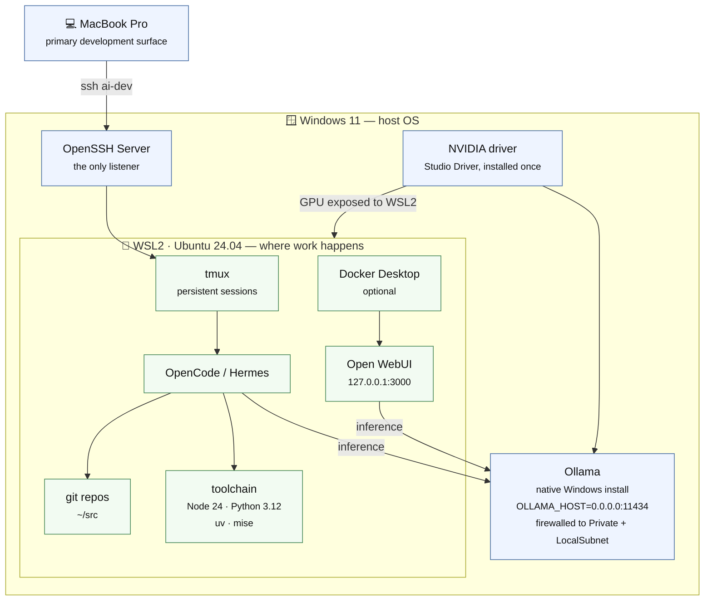
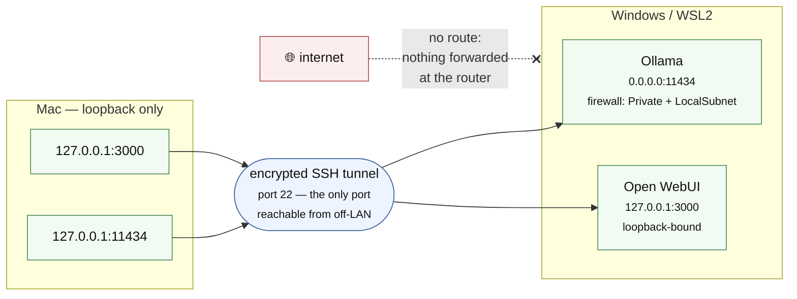
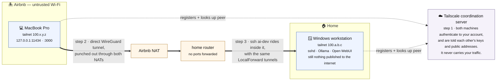

# Architecture

## Target design

-   **Windows 11 remains the host.** It owns the NVIDIA driver, runs Ollama natively, and is the one place OpenSSH listens. This gives full RTX GPU support without dual-booting, and keeps Steam compatibility if you ever want it.
-   **Ubuntu 24.04 under WSL2 is where development happens.** Git, Python, Node.js, `uv`, `mise`, build tools, coding agents (OpenCode, Hermes), and your product repositories all live here.
-   **Docker Desktop** is optional infrastructure, used here to run Open WebUI.
-   **The Mac connects over SSH only.** Ollama and Open WebUI ports are tunneled through the SSH connection, not exposed to the LAN or internet.



## Tools and versions this repo targets

Only a few things here are actually pinned; most are installed at whatever version their installer currently ships. That distinction matters when something breaks, so it's called out per row: **pinned** means the version is written into a script in this repo, **rolling** means you get current-at-install-time.

### Platform

| Component | Version | Pinned? | Where |
|---|---|---|---|
| Windows 11 | 11 (any current build) | — | host OS assumption throughout |
| PowerShell | 5.1+ to *run* the bootstrap | pinned | `#requires -Version 5.1` in [`scripts/bootstrap-windows.ps1`](../scripts/bootstrap-windows.ps1) |
| PowerShell 7 | current | rolling | installed alongside 5.1 via winget `Microsoft.PowerShell` |
| WSL | 2 | pinned | `wsl --set-default-version 2` |
| Ubuntu | 24.04 LTS | pinned | distro name `Ubuntu-24.04`, used verbatim in the scripts and in `wsl -d` commands |
| OpenSSH Server | Windows capability `OpenSSH.Server~~~~0.0.1.0` | pinned | queried and enabled by name, rather than enumerating all capabilities |
| NVIDIA driver | current Studio Driver | rolling | installed by hand via the NVIDIA App, Windows-side only |

### WSL toolchain

| Tool | Version | Pinned? | Where |
|---|---|---|---|
| Node.js | 24.x | pinned | `mise use --global node@24` |
| Python | 3.12.x | pinned | `mise use --global python@3.12` — also Ubuntu 24.04's system `python3` |
| `mise` | current | rolling | install script from `mise.run` |
| `uv` | current | rolling | install script from `astral.sh/uv` |
| CLI tooling | Ubuntu 24.04 repo versions | rolling | `git`, `gh`, `jq`, `ripgrep`, `fd-find`, `fzf`, `tmux`, `htop`, `btop`, `nvtop`, `direnv`, `shellcheck`, `sqlite3`, `socat`, `build-essential` |

Because `mise` pins Node and Python globally, a project that needs something else should override it per-directory (`mise use node@22`) rather than changing the global pins.

### Services

| Service | Version | Pinned? | Notes |
|---|---|---|---|
| Ollama | current | rolling | winget `Ollama.Ollama`, running natively on Windows |
| Open WebUI | `:main` tag | rolling | `ghcr.io/open-webui/open-webui:main` in [`config/docker-compose.yml`](../config/docker-compose.yml) — a moving tag, so `docker compose pull` can change it under you |
| Docker Compose | v2 syntax | pinned | `docker compose` (no `version:` key in the file); Docker Desktop with the WSL2 engine |
| Tailscale | current | rolling | winget `Tailscale.Tailscale` on Windows, plus the Mac client |

Ollama's runtime settings are set as user environment variables by the Windows bootstrap and are deliberately conservative for 16GB VRAM / 16GB system RAM: `OLLAMA_MAX_LOADED_MODELS=1`, `OLLAMA_NUM_PARALLEL=1`, `OLLAMA_CONTEXT_LENGTH=8192`, `OLLAMA_FLASH_ATTENTION=1`, `OLLAMA_KV_CACHE_TYPE=q8_0`. Raise these after a RAM upgrade, not before.

### Models and agents

| Item | Version | Pinned? | Notes |
|---|---|---|---|
| `qwen3.5:9b` | tag pinned | pinned | default model, pulled by [`scripts/pull-models.sh`](../scripts/pull-models.sh) and referenced in [`config/opencode.json.example`](../config/opencode.json.example) |
| `gemma4:12b` | tag pinned | pinned | second starter model |
| `gpt-oss:20b` | tag pinned | opt-in | only with `FULL=1`; see [`models.md`](models.md) |
| OpenCode | current | rolling | config validated against `https://opencode.ai/config.json`; the Ollama provider goes through the `@ai-sdk/openai-compatible` npm package |
| Hermes | current | rolling | install script, on by default (`INSTALL_HERMES=1`) |
| OpenClaw | current | opt-in | not installed unless `INSTALL_OPENCLAW=1` |

## Why one NVIDIA driver, not two

WSL2 exposes the **Windows** GPU driver to Linux. Do not `apt install nvidia-driver` inside Ubuntu/WSL — installing a second, Linux-native display driver can break that arrangement. Install the NVIDIA driver once, on Windows, via the NVIDIA App (Studio Driver).

## Why SSH tunneling instead of exposing ports

**Because Ollama and Open WebUI were not built to be the thing standing between the internet and your machine, and SSH was.**

Unpacked, that's three separate reasons:

1.  **The services have no meaningful authentication of their own.** The Ollama API has none at all: anyone who can reach port 11434 can list your models, run inference on your GPU, and pull or delete models. Open WebUI has a login, but it's a web app you'd be asking to survive direct internet exposure, patched on your schedule rather than an attacker's. Bind either one to a routable interface and reachability *is* authorization.
2.  **One door instead of three.** Exposing ports means every service is its own front door with its own auth story and its own patch cadence. Tunneling collapses that to a single remote entry point — OpenSSH, key-only, no passwords — and leaves everything else reachable only from the machine itself or its local subnet. A bug in Open WebUI stops being remotely reachable.
3.  **Encryption and identity come for free.** Ollama speaks plain HTTP and Open WebUI is HTTP behind the tunnel, so exposing them directly means prompts, code, and responses cross the network in the clear unless you also stand up TLS and certificates. Inside SSH it's all encrypted, and the client is authenticated by keypair before a single byte reaches the app.

The cost of this is one config block. `~/.ssh/config` on the Mac (see [`config/ssh-config.example`](../config/ssh-config.example)) does the local port forwarding:

```text
LocalForward 11434 127.0.0.1:11434   # Ollama API
LocalForward 3000  127.0.0.1:3000    # Open WebUI
```

`ssh ai-dev` opens the tunnels as a side effect of the shell session you wanted anyway. While it's up, `http://127.0.0.1:11434` and `http://127.0.0.1:3000` on the Mac reach the services on the Windows/WSL box. Close the session and the tunnel is gone with it.

Worth being precise about what "not exposed" means here, because the two services aren't bound the same way:

-   **Open WebUI is genuinely loopback-only.** [`config/docker-compose.yml`](../config/docker-compose.yml) publishes it as `127.0.0.1:3000:8080` — the container port is reachable from the host's loopback interface and nowhere else.
-   **Ollama listens on all interfaces, on purpose.** [`scripts/bootstrap-windows.ps1`](../scripts/bootstrap-windows.ps1) sets `OLLAMA_HOST=0.0.0.0:11434`, because WSL2 and Docker Desktop reach the Windows host across a virtual network adapter, not over loopback — bind it to `127.0.0.1` and nothing in WSL can talk to it. What contains it is a Windows firewall rule scoped to the **Private** profile and `LocalSubnet` only, so it's reachable from your own LAN and not from a Public-profile network. Nothing is forwarded at the router either way, so neither service is reachable from the internet.

That LAN reachability is a deliberate trade, and it's the reason the "no auth at all" point above matters: on a network you don't control, treat the Windows firewall profile as the thing doing the work, and confirm it's set to Public.



## Taking it on the road: Tailscale

At home this works because the Mac and the workstation share a LAN, so `HostName` can be a `192.168.x.x` address. In an Airbnb it can't: you're behind someone else's NAT, the box is behind yours, and neither side can dial the other directly.

The wrong fix is to forward port 22 on the home router — that publishes a permanent, internet-visible SSH listener attached to your home IP, to be found by the scanners that sweep the entire address space continuously. Do not do it.

The right fix is [Tailscale](https://tailscale.com) on both machines. It's a WireGuard mesh VPN: each machine authenticates to your Tailscale account, gets a stable private address on your personal network (a *tailnet*), and the two peers negotiate a direct encrypted connection by punching out through both NATs — so **nothing is ever opened on the router**, and the workstation stays invisible to the public internet. To your SSH client, the workstation just looks like it's on the local network again, wherever you are.



In practice, the change is one line. Point `HostName` at the workstation's Tailscale address instead of its LAN address:

```text
Host ai-dev
  HostName 100.a.b.c          # or the MagicDNS name, e.g. ai-win.tail1234.ts.net
  # everything else — User, IdentityFile, RemoteCommand, LocalForward — unchanged
```

Everything downstream of that is identical: the same key-only SSH auth, the same `LocalForward` lines, the same `127.0.0.1:11434` and `127.0.0.1:3000` on the Mac. You are still not exposing Ollama or Open WebUI to anything — they remain bound to loopback on the workstation, now reached through two layers of encryption (WireGuard, then SSH) rather than one.

Two things worth setting up before you travel, while you still have physical access to the box:

-   **Disable key expiry** on the workstation in the Tailscale admin console, or its key will expire mid-trip and drop it off the tailnet with no one there to re-authenticate it.
-   **Check that it stays awake.** Windows sleeping is the most common cause of "Tailscale is broken" from a hotel room. Set the power plan to never sleep, and confirm Tailscale is running as a service at boot rather than only after you log in.

## System RAM vs. GPU VRAM

These are two different budgets, and local-LLM tooling cares about both:

-   **VRAM** (16GB on the RTX 5070 Ti here) determines how much of a model can run on the GPU. More of the model on GPU = faster inference.
-   **System RAM** (16GB in the base configuration) is the more immediate constraint — it limits how much else the box can do at once (WSL, Docker, the OS itself) and is a strong candidate for a first hardware upgrade to 64GB.

Check `ollama ps` after loading a model — for a model sized to fit the hardware, it should report fully or almost fully GPU-resident. A CPU/GPU split usually means: reduce context size, unload another model, or pick a smaller quantization.

## Working from the Mac, or working at the box

The default assumption in this repo is that the Mac stays the primary development surface and the workstation behaves like a headless compute node: SSH in, attach a `tmux` session, do the work, detach, come back later. That's a preference, not a constraint — it's what keeps one keyboard and one set of dotfiles in play, and it's the mode the SSH config and tunnels are written for.

Sitting down at the box and working directly in WSL is a perfectly good option, and if you're comfortable in a UNIX shell there's nothing to unlearn: it's the same Ubuntu 24.04, the same `~/src`, the same agents and toolchain. A couple of things make the two modes interchangeable rather than either/or:

-   **`tmux` sessions are shared, not per-connection.** Start work at the box, `tmux new -As ai`, walk away, then `ssh ai-dev` from the Mac and `tmux attach -t ai` picks up exactly where you left off — and back again.
-   **Local access doesn't need the tunnels.** At the box, Ollama and Open WebUI are already on `127.0.0.1` from WSL's point of view — no forwarding involved. The `LocalForward` lines exist to give the *Mac* that same loopback view, so they simply don't come into play when you're sitting there.

The one thing worth keeping consistent either way is where state lives: repos in `~/src` inside WSL, not on the Windows filesystem under `/mnt/c`. Crossing the filesystem boundary is slow for git and for anything that watches files, and it's the difference that tends to bite when you switch between the two modes.

See [`troubleshooting.md`](troubleshooting.md) for the two setup bugs this architecture surfaced in practice, and [`security.md`](security.md) for the access boundaries around agents running in this environment.